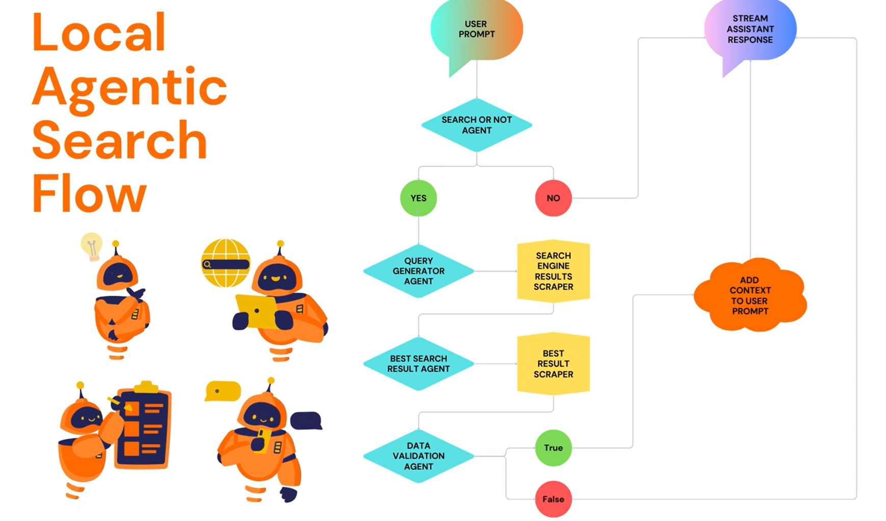
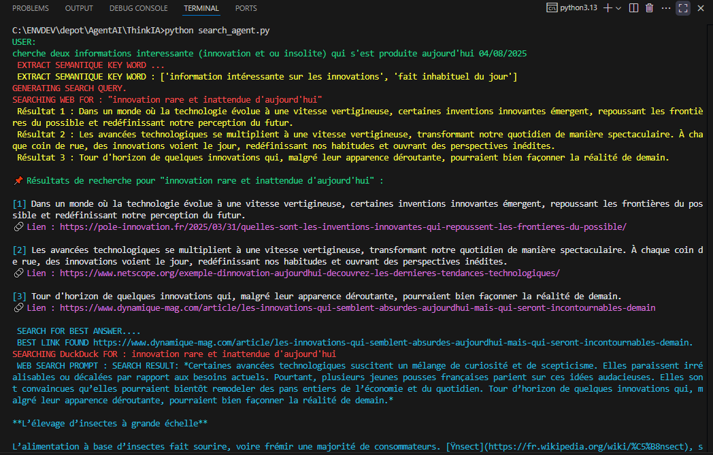

# 🧠 Search Agent – Assistant IA avec Recherche Web Intelligente

**Search Agent** est un assistant intelligent en Python capable d'améliorer ses réponses grâce à des recherches web en temps réel. Il utilise le modèle `ollama` via Ollama, extrait des mots-clés sémantiques, interroge DuckDuckGo ou Google, sélectionne les résultats les plus pertinents et génère des réponses contextualisées.

---



## 🚀 Fonctionnalités

- ✅ Extraction sémantique des mots-clés à partir de l’entrée utilisateur
- 🔍 Recherche web via DuckDuckGo ou Google
- 🧭 Sélection intelligente du meilleur résultat
- 📄 Scraping de pages web + filtrage contextuel
- 🤖 Réponses enrichies avec le modèle Ollama (`phi4-mini`)
- 🎨 Affichage coloré dans le terminal grâce à Colorama

---

## 📦 Installation

Prérequis : [Python 3.10+](https://www.python.org/downloads/)

```bash
# Cloner le dépôt
git clone https://github.com/votre-utilisateur/search-agent.git
cd search-agent

# (Optionnel) Créer un environnement virtuel
python -m venv .venv
source .venv/bin/activate    # ou .venv\Scripts\activate sous Windows

# Installer les dépendances
pip install -r requirements.txt

python -m pip install -r requirements.txt
```
# Exemple 
## Pré-requis : ollama
Assure-toi que Ollama est bien installé et que le modèle phi4-mini est lancé :
```bash
ollama serve # s'il n'est pas encore lancer

ollama run phi4-mini:latest

# vérifi que le modèle est bien lancé
ollama ps

```

## ▶️ lancement du programme 
Exécute le script principal :

```bash
python search_agent.py
```

Exemple d’entrée utilisateur :
```bash
 cherche deux informations interessante (innovation et ou insolite) qui s'est produite aujourd'hui 04/08/2025
```

## 🖥️ Exemple de sortie console


# Reférence : https://www.youtube.com/watch?v=9KKnNh89AGU