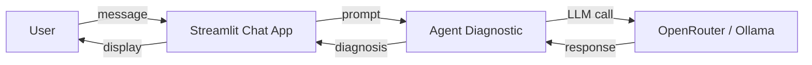

# Architecture Spine — ThinkIA Diagnostic Chat Web

## Design Paradigm

**Streamlit Session Chat** — L'interface est une app Streamlit monopage. L'état de la conversation est géré via `st.session_state`. Chaque message utilisateur déclenche un appel synchrone à l'agent diagnostic, qui utilise OpenRouter (cloud) ou Ollama (local) selon la configuration.



## Invariants & Rules

### AD-1 — Streamlit comme framework d'interface

- **Binds:** Interface utilisateur, déploiement
- **Prevents:** Choix d'un framework JS, multi-page complexe
- **Rule:** L'interface est une app Streamlit monopage (`st.chat_input` + `st.chat_message`). Pas de framework web additionnel.

### AD-2 — Double mode LLM : local (Ollama) / distant (OpenRouter)

- **Binds:** Provider LLM, configuration
- **Prevents:** Dépendance exclusive à un seul fournisseur
- **Rule:** L'app détecte la présence d'Ollama (localhost:11434) ; si disponible, propose le choix dans la sidebar. En cloud (Streamlit Cloud), seul OpenRouter est accessible via les secrets.

### AD-3 — Secrets Streamlit pour les clés API en production

- **Binds:** Déploiement cloud
- **Prevents:** Clés en clair dans le repo
- **Rule:** Les clés API sont injectées via `.streamlit/secrets.toml` en local (ignoré par git) et via les secrets Streamlit Cloud en production. Le repo ne contient aucun fichier `.env` ni clé.

### AD-4 — Session state comme seul stockage de conversation

- **Binds:** Historique de chat
- **Prevents:** Base de données, stockage persistant, fichiers temporaires
- **Rule:** L'historique est conservé dans `st.session_state` pour la durée de la session Streamlit. Pas de persistance entre sessions.

### AD-5 — Point d'entrée unique à la racine

- **Binds:** Déploiement Streamlit Cloud
- **Prevents:** Plusieurs pages Streamlit, configuration complexe
- **Rule:** Le fichier `streamlit_app.py` à la racine est le point d'entrée unique. Streamlit Cloud le détecte automatiquement.

## Consistency Conventions

| Concern | Convention |
| --- | --- |
| Fichier app | `streamlit_app.py` à la racine |
| Page web | `iapps/diagnostic/chat_app.py` (logique de chat, importée par `streamlit_app.py`) |
| Secrets locaux | `.streamlit/secrets.toml` (ignoré par git) |
| Secrets cloud | Streamlit Cloud Secrets Manager |
| Configuration | `config/config.py` inchangé (réutilisé par l'agent) |

## Stack

| Name | Version |
| --- | --- |
| Python | 3.10+ |
| Streamlit | >=1.48.0 |
| Ollama (optionnel) | >=0.5.1 |
| openrouter_provider.py | existant |
| diagnostic_ia_agents.py | existant |

## Structural Seed

```
ThinkIA/
├── streamlit_app.py              # [NEW] Point d'entrée Streamlit Cloud
├── .streamlit/
│   └── secrets.toml              # [NEW] Secrets locaux (ignoré par git)
├── iapps/diagnostic/
│   ├── diagnostic_ia_agents.py   # Existant – agent diagnostic
│   └── chat_app.py               # [NEW] Logique de chat Streamlit
```

## Capability → Architecture Map

| Capabilité | Vit dans | Gouverné par |
| --- | --- | --- |
| Chat UI | `chat_app.py` | AD-1, AD-4, AD-5 |
| Appel LLM | Agent diagnostic + provider | AD-2 |
| Clés API | Secrets Streamlit | AD-3 |
| Déploiement | `streamlit_app.py` + Streamlit Cloud | AD-5 |

## Deferred

- **Tests automatisés de l'UI** — v2 ; nécessite `playwright` + setup Streamlit Cloud dédié
- **Support de l'agent i-search** — v2 ; nécessite une interface différente (multi-agent)
- **Logs / monitoring** — v2
