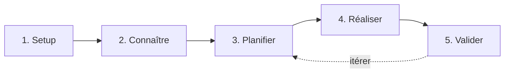

# BMad Workflow – ThinkIA

[BMad](https://opencode.ai) est une méthode de développement structurée en phases, conçue pour être pilotée par IA via OpenCode. Elle assure traçabilité, qualité et alignement entre l'intention produit et le code livré.

---

## Workflow simplifié (5 phases)



---

### 1. Setup – Initialiser BMad

```bash
# Créer la structure _bmad
mkdir _bmad _bmad/bmm _bmad/scripts _bmad/custom _bmad/_config
```

Créer `_bmad/bmm/config.yaml` :
```yaml
project_name: ThinkIA
user_name: jerougui
communication_language: fr
document_output_language: fr
user_skill_level: intermédiaire
planning_artifacts: _bmad/planning
implementation_artifacts: _bmad/stories
project_knowledge: README.md
```

### 2. Connaître – Documenter le projet

Utiliser la compétence `bmad-document-project` pour générer la base de connaissances du projet :

```
/opencode load bmad-document-project
```

Cela produit un `project-context.md` qui servira de mémoire à toutes les phases suivantes.

### 3. Planifier – Définir les objectifs

| Compétence | Rôle |
|---|---|
| `bmad-prd` | Rédiger le Product Requirements Document |
| `bmad-architecture` | Définir l'architecture spine (invariants techniques) |
| `bmad-create-epics-and-stories` | Découper en epics et user stories |
| `bmad-sprint-planning` | Générer le suivi de sprint |

**Ordre recommandé :** PRD → Architecture → Epics/Stories → Sprint planning.

Chaque compétence se lance dans une **nouvelle session OpenCode** :

```
/opencode load bmad-prd
```

### 4. Réaliser – Implémenter les stories

Chaque story est implémentée via `bmad-dev-story` ou `bmad-quick-dev` :

```
/opencode load bmad-dev-story
```

Le cycle : lire la story → implémenter (TDD) → valider → marquer `review`.

Utiliser `bmad-check-implementation-readiness` avant de commencer le développement pour vérifier que tout est prêt.

### 5. Valider – Review & rétrospective

| Compétence | Rôle |
|---|---|
| `bmad-code-review` | Revue de code adversarial |
| `bmad-checkpoint-preview` | Revue de jalon (humain dans la boucle) |
| `bmad-retrospective` | Rétrospective post-epic |

---

## Résumé des commandes clés

```bash
# 1. Setup (une fois)
mkdir -p _bmad/{bmm,scripts,custom,_config,planning,stories}
# éditer _bmad/bmm/config.yaml

# 2-5. Lancer chaque compétence dans une session OpenCode dédiée
opencode   # puis /opencode load bmad-<skill>
```

> **Règle d'or :** chaque compétence s'exécute dans **une session OpenCode fraîche** pour éviter la pollution de contexte.

---

## Structure _bmad générée

```
_bmad/
├── bmm/
│   └── config.yaml
├── scripts/
├── custom/
├── _config/
├── planning/       # PRD, architecture, epics
└── stories/        # stories individuelles + sprint-status.yaml
```

---

*Document généré le 2026-07-18 – adapter les chemins et skills selon l'évolution du projet.*
